# Project Report (Data Analysis and Visualization)

>[!Note]
> **Participants**
> - Kartikey Shahi
> - Rohit Singh Tanwar
> - Dhruv Singh Rawat
> - Vivek Singh Yadav

---

## Objectives of our analysis

### My analysis will be more focussed towards Indian Developers

1. General things
    - To analyse the amount of developers from India Participating in this survery
    - To analyse the proffession, interest and background of those developers
    - To analyse the field of work of Indian developers
    - Distribution of student among India developers

2. Demographics and education
    - What is the age distribution of Indian developers?
    - Education background of Indian devs, from where they learned to code
    - Means of documentation for Indian devs

3. Technology and Skills
    - What programming languages, tools, and frameworks are most popular among Indian developers?
    - Which technologies are Indian developers most interested in learning?
    - What percentage of Indian developers work on open-source projects?
    - Most Used Web Framework withing India Developers

4. Professional Life
    - What is the average work experience of developers in India?
    - What is the distribution of annual compensation for Indian developers according to their age?
    - Make a histogram on the compansesation of India developers

5. Technology and Skills
    - What programming languages, tools, and frameworks are most popular among Indian developers?
    - Which technologies are Indian developers most interested in learning?
    - What percentage of Indian developers work on open-source projects?
    - Most Used Web Framework withing India Developers

6. AI related
    - Distribution of utilisation of AI by Indian developers (on type of work done by AI)
    - Sentiment of Indian Developers who thinks AI is threat, on the basis of their workex.

7. Operating System
    - To compare the level of experience of different operating system users
    - To see the distribution of total number of os users in pie chart

8. DevTools
    - Make a Bar chart showing how many people uses which tool to write their code
    - Make a line chart of DevTools vs Average salary of devs using them

----

# Our Solution to the above objectives respectively

## General things

##### To analyse the amount of developers from India Participating in this survery

For this we've plotted a bar plot, by groupping on the basis of age group and then plotting it against the count of devs in that particular age group

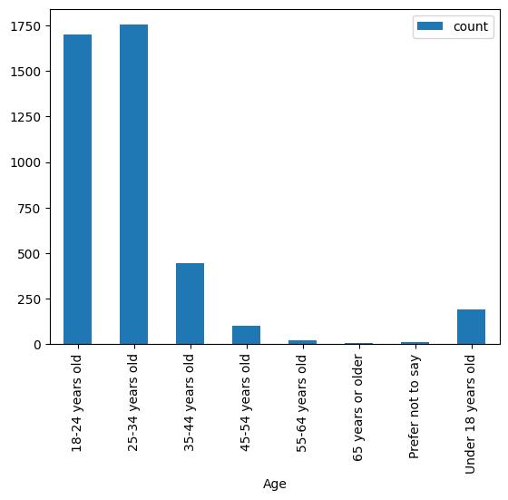

##### To analyse the proffession, interest and background of those developers

After our analysis on this particular objective we found the following

>[!IMPORTANT]
> There a **2830** devs who are employed in some or other manner
> There are **935** students in Indian developers community
> There are **127** students who are employed in some or other manner

and gernerated the following the box-plot regarding the componsation distribution of Indian devs

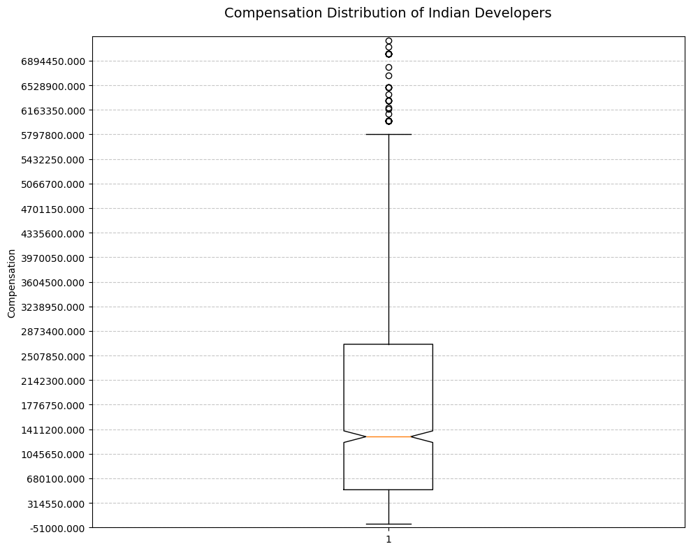

and discovered thiese stats

>[!IMPORTANT]
> Average compensation of Indian devs is **48921930380.79304**
> Median compensation of Indian devs is **1300000.0**

#### To analyse the field of work of Indian developers

I've produced a vertical bar plot for this purpose

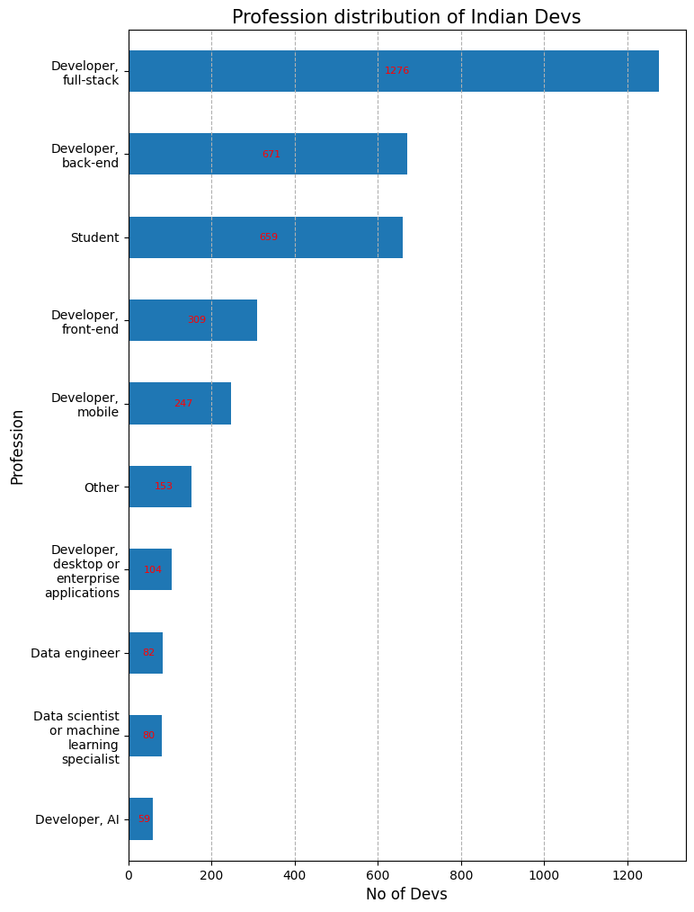

#### Distribution of student among India developers

For this purpose i've perpared a dual bar chart comparing the total number of devs from student background and non-student background in a given age group

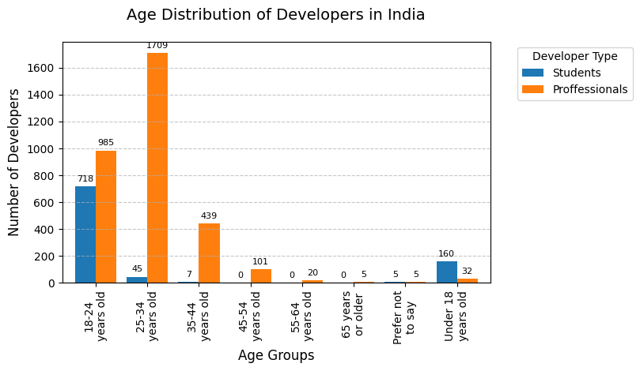

And i've prepared a horizonatal stacked bar chart to compare the percentage of devs from student and non-student background

## Demographics and education

#### What is the age distribution of Indian developers?

We have achieved this objective by drawing a visualisation of distribution of Indian devs according to their age

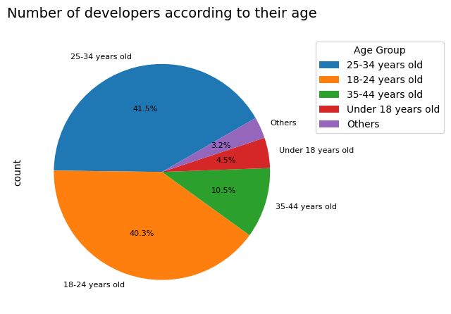

#### Education background of Indian devs, from where they learned to code
- What online and offline materials do devs use to learn to code?
- What online and offline materials do students use to learn to code?
- How many student refer documentation while learning to code?

We have made a comparitive line chart and scatter plot to compare the difference between the learning method of proffessional devs vs students

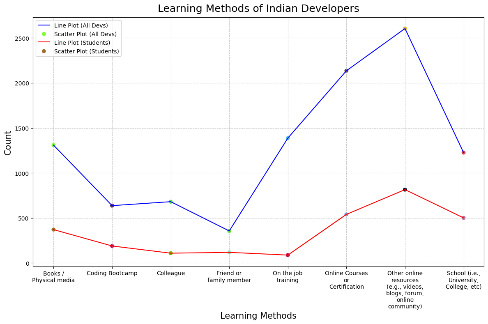

#### Means of documentation for Indian Devs

We have made a comparitive line chart and scatter plot to compare the difference between the documentation reffering method of proffessional devs vs students

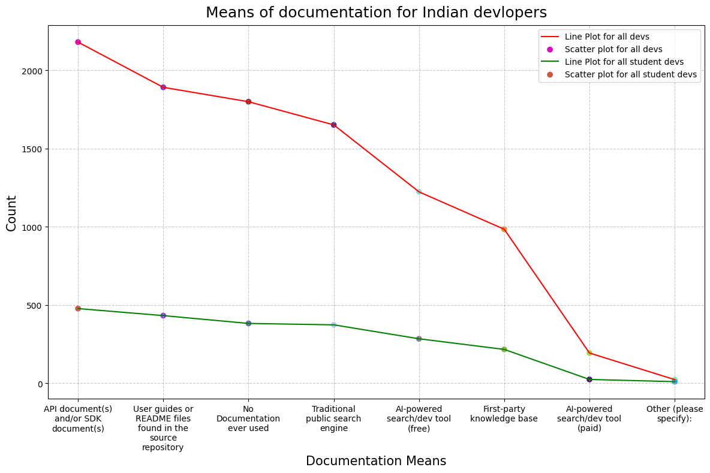

## Technology and Skills

####  What programming languages, tools, and frameworks are most popular among Indian developers?

This was the most challenging for us till now in this analysis, we have made horizontal bar chart to showcase and compare the popularity of languages, tools and framework

we have categorized our analysis for this particular objective in three section

1. **About languages, languages people currently using, want to use and language peple admire**

For this we have cooked three three plots describing the statistics

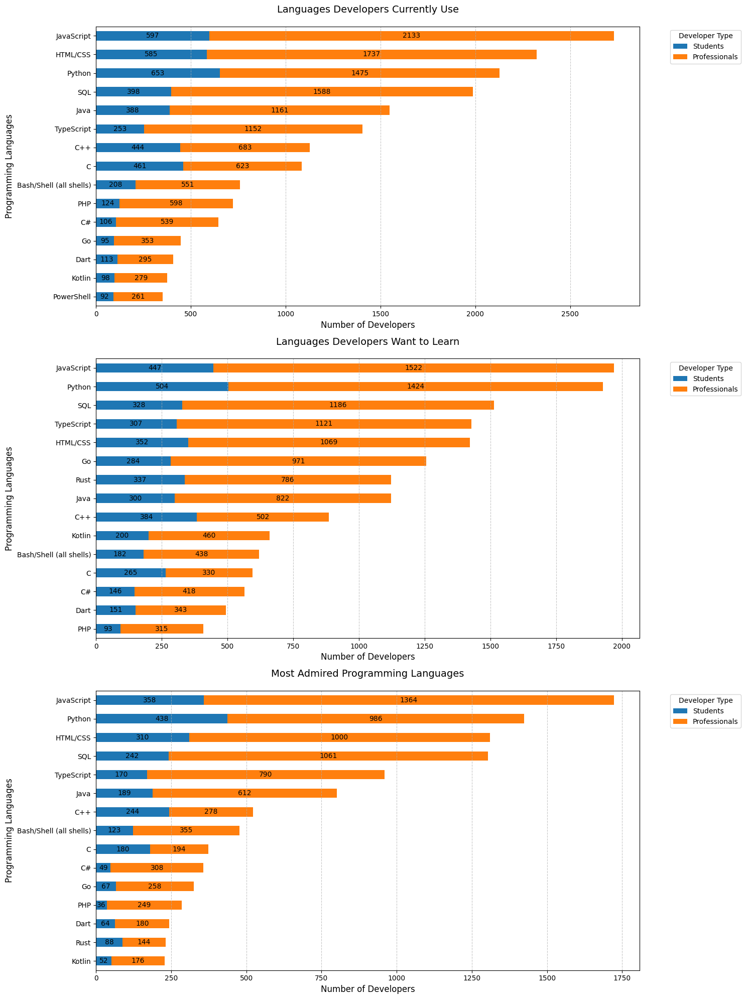

2. **About web framework, web framework people currently using, want to use and web framework peple admire**

For this we have cooked three three plots describing the statistics

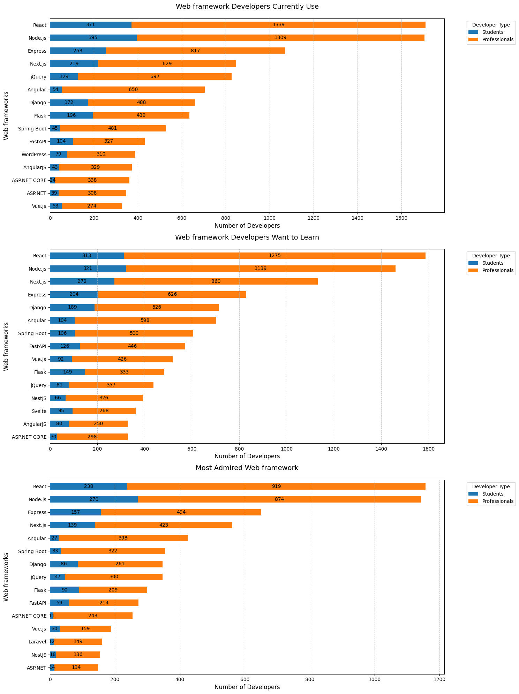

3. **About dev tools, dev tools people currently using, want to use and dev tools peple admire**

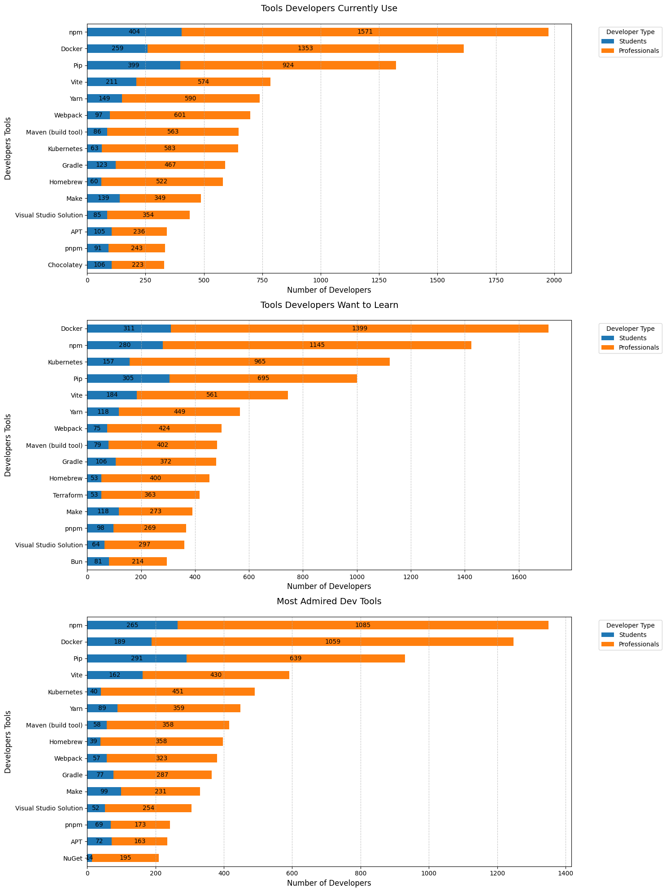

4. ###### About collab tools and ide's, collab tools and ide's people currently using, want to use and collab tools and ide's peple admire

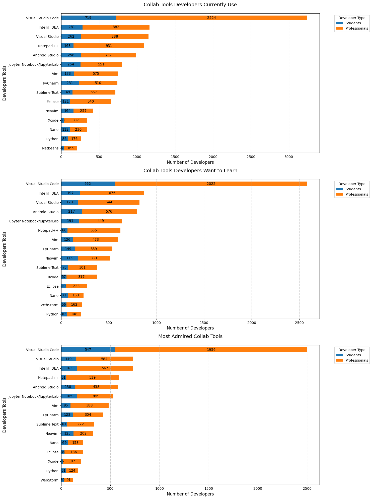
